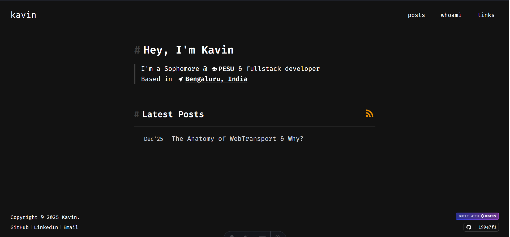

## site $`^{3}`$
> my personal website and blog, built with Astro,React and Tailwind CSS.




## instructions for development


1. Clone the repository:
    ```bash
    git clone https://github.com/kavin81/site
    ```

2. Install dependencies and start the development server:

    ```bash
    cd site
    pnpm install
    pnpm run dev
    ```

## License

- This project is licensed under the MIT License. See the [LICENSE](./LICENSE) file for details.

## Acknowledgements

- 3rd party libraries & claude :D